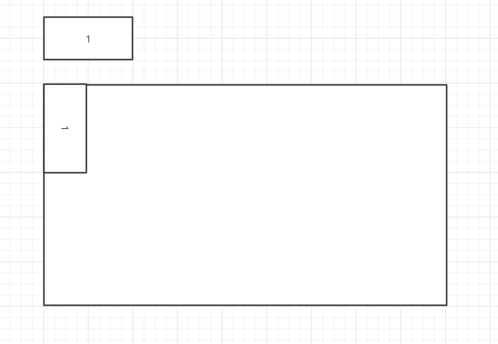
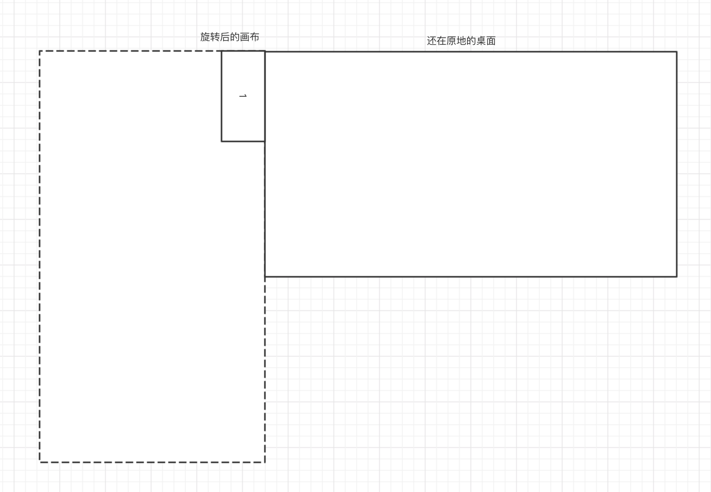
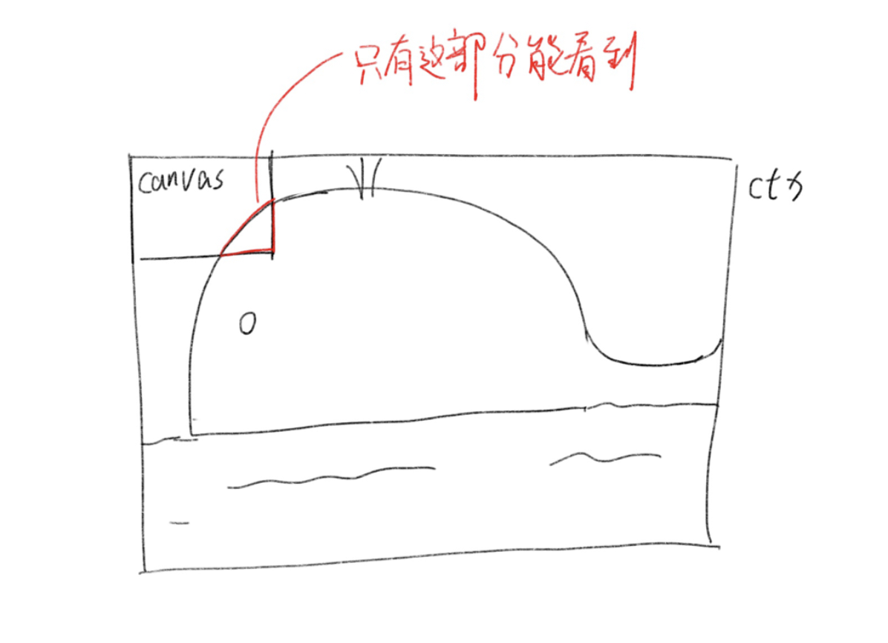
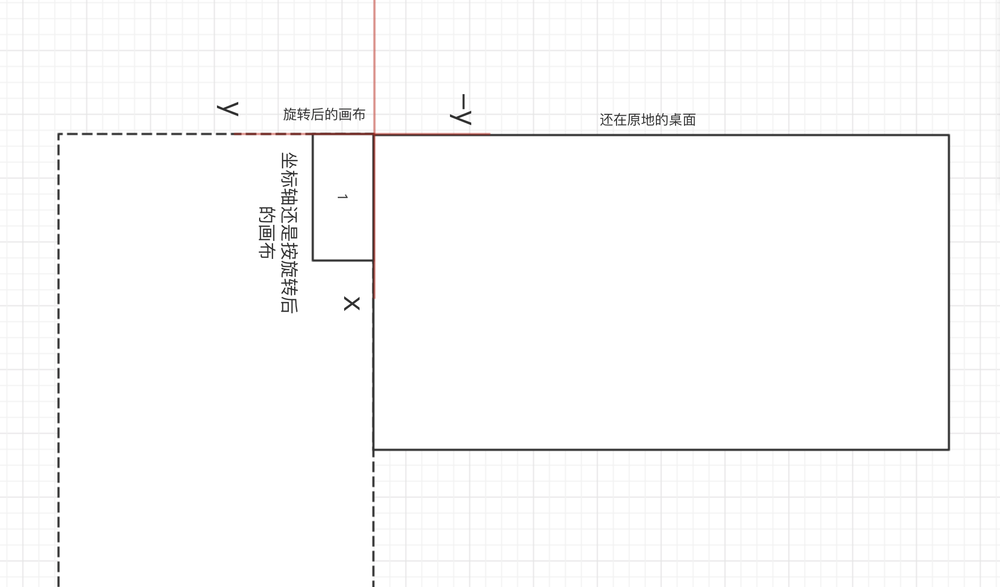

手上接到一个需求，将多种图片经过放大、旋转后绘制在一张 `canvas` 上，放大都还好理解，但旋转真的是废头发。

<!--more-->

举个最简单的例子吧，现在有 8x4 的图片，需要将图片旋转 90° 后放在左上角



怎么实现呢？这样吗？

```js
// 将画布旋转 90°
ctx.rotate(90);
// 在 0, 0 绘制图片
ctx.drawImage(img, 0, 0);
```

`canvas` 没有提供「旋转图片」的方法，只能旋转画布，结果实际上变成了这样



`ctx` 与 `canvas` 可以看作两个东西，一个是画布(ctx)，另一个是桌子(canvas)。我们是在画布上绘制图形，但是画布最终要放到桌子上，平展开来才能看清楚。



这就导致了我们如果想实现旋转，需要通过计算才能得出「实际的」x 和 y 值。
比如上面旋转 90° 的例子，在画布旋转 90° 后，默认位于 0, 0，然后 x 轴不变，往「上」移动 4px，



所以最终代码是

```js
ctx.rotate(90);
// 4 是图片的高度
ctx.drawImage(img, 0, -4);
```

90° 可以通过「直接看」计算出位置，但是其他角度呢？

为什么没有一个简单的旋转方法呢？

## easy-rotate-in-canvas

为了解决这个头疼的问题，我们可以把计算封装好，暴露友好的操作接口。还是上面旋转 90° 的例子，可以写成

```js
ctx.drawImage(img, {
    x: 4,
    y: 0,
    rotate: 90
});
```

或者更语义化的

```js
ctx.drawImage(img).move(4, 0).rotate(90);
```

或者更多，都是可以实现的，尽量将操作简化。不过目前只实现了第一种方式。

### Usage

```bash
yarn add easy-rotate-in-canvas
```

```js
import enhance from 'easy-rotate-in-canvas';

const canvas = document.getElementById('canvas');
const ctx = enhance(canvas.getContext('2d'));

ctx.drawImage(img, {
    // options
});
```

或者直接引用 `<script src="https://unpkg.com/easy-rotate-in-canvas@1.0.2"></script>`，`enhance` 方法会挂载到全局，直接使用即可。

更多内容可以访问
- [easy-rotate-in-canvas](https://github.com/ltaoo/easy-rotate-in-canvas)
- [online example](https://ltaoo.github.io/easy-rotate-in-canvas/)
