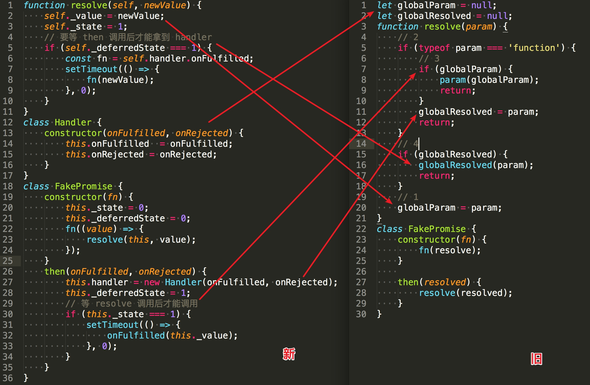

- [一次「错误」的 Promise 实现 - 1](/2018/02/11/一次「错误」的%20Promise%20实现/)

时隔快两月，才产出了第二篇。在实际写博客中，发现`Promise`实在太难了，初稿在 2/18 就开始写，写到「链式调用」，发现自己还是对原理不够了解，于是耽搁了许久。期间又看了《你不知道的 JavaScript（中卷）》关于异步的部分，深觉自己的浅薄。

我们总是说回调不好用，因为回调地狱，但是回调也可以不写成回调地狱，只是写法问题，如：

```javascript
foo(function () {
    foo(function () {
        foo(function () {
            console.log('callback hell');
        });
    });
});

// 可以写成这样
function handler1() {
    foo(handler2);
}

function handler2() {
    foo(handler3);
}
function handler3() {
    console.log('callback hell?');
}

foo(handler1);
```

而且本质上来说，`Promise`也是回调啊，`Promise`究竟在内部做了什么事情，让我们非常乐意接受了呢？

<!-- more -->

## 核心机制

之前的「错误」实现，核心在于`resolve`里面的条件判断与两个全局变量。

更合理的实现是将需要的变量保存在对象上或者局部作用域，同时也将状态补充进来。


### constructor

```javascript
function resolve(value) {
    // ...
}
function reject(reason) {
    // ...
}
/**
 *  0 - Pending   即「处理中」
 *  1 - Fulfilled 即「成功」
 *  2 - Rejected  即「失败」
 */
class FakePromise {
    constructor(fn) {
        // 开始状态为 「处理中」
        this._state = 0;
        fn(resolve, reject);
    }
}
```

只是多了`_state`和`reject`，一切看起来还好。

### then 方法

```javascript
class Handler {
    constructor(onFulfilled, onRejected) {
        this.onFulfilled = onFulfilled;
        this.onRejected = onRejected;
    }
}
class FakePromise {
    constructor(fn) {
        this._state = 0;
        fn(resolve, reject);
    }
    then(onFulfilled, onRejected) {
        this.handler = new Handler(onFulfilled, onRejected);
    }
}
```

多增加了`Handler`类，不将`onFulfilled`保存到全局`globalResolved`变量了，而是保存到`this.handler`变量上。

### resolve

```javascript
function resolve(newValue, self) {
    // 到了这里，就表示「成功」，需要改变 promise 的状态了，增加 self 参数为 promise 实例
    self._state = 1;
    // 值`newValue`也不保存到全局变量`globalParam`，也保存到`promise`实例上。
    self._value = newValue;
}
/**
 *  0 - Pending
 *  1 - Fulfilled
 *  2 - Rejected
 */
class FakePromise {
    constructor(fn) {
        this._state = 0;
        const self = this;
        // fn(resolve, reject);
        fn(
            function (value) {
                resolve(value, self);
            },
            function (reason) {
                reject(reason, self);
            }
        );
    }
}
```

然后就可以调用`onFulfilled`了：

```javascript
function resolve(newValue, self) {
    self._state = 1;
    self._value = newValue;
    
    const handler = self.handler;
    const fn = handler.onFulfilled;
    fn(self._value); // 调用 onFulfilled
}
```

但实际执行时，`handler`是`undefined`导致报错：

```bash
var fn = handler.onFulfilled;
                 ^

TypeError: Cannot read property 'onFulfilled' of undefined
```

这就是在之前也遇到过的，`resolve`想通知`resolved`时发现`resolved`还没有出现的问题。

之前是通过`resolve`中的 4 个条件分支进行处理，而更合理的实现是增加`this._deferredState`变量，根据该变量进行区分，该变量有两个状态：

- 0 - 初始化时的值，表示初始化状态
- 1 - 完成同步代码的执行，等待异步代码执行完成并调用 `resolve` 或 `reject`

那么在什么时候改变这个状态呢？答案是`then()`调用时，并且也要调用一次`resolve`。

```javascript
then(onFulfilled, onRejected) {
    this.handler = new Handler(onFulfilled, onRejected);
    this._deferredState = 1;
    handleResolve(this, this.handler);
}
```

此时完整代码如下：

```javascript
function resolve(newValue, self) {
    self._state = 1;
    self._value = newValue;

    if (self._deferredState === 1) {
        const handler = self.handler;
        const fn = handler.onFulfilled;
        fn(self._value);
    }
}

class Handler {
    constructor(onFulfilled, onRejected) {
        this.onFulfilled = onFulfilled;
        this.onRejected = onRejected;
    }
}
class FakePromise {
    constructor(fn) {
        this._state = 0;
        this._deferredState = 0;
        const self = this;
        // fn(resolve, reject);
        fn(
            function (value) {
                resolve(value, self);
            },
            function (reason) {
                reject(reason, self);
            }
        );
    }
    then(onFulfilled, onRejected) {
        this.handler = new Handler(onFulfilled, onRejected);
        this._deferredState = 1;
        onFulfilled(this._value);
    }
}
```

测试用例：

```javascript
new FakePromise((resolve) => {
    resolve('b');
})
    .then((res) => {
        console.log(res);
    });
```

能够成功打印`hello`，但是改成异步就出问题了，先打印了`undefined`，再打印了`hello`。


测试用例：
```javascript
new FakePromise((resolve) => {
    setTimeout(() => {
        resolve('b');
    }, 1000);
})
    .then((res) => {
        console.log(res); // 会先调用这里，打印 undefined，待 resolve 执行后，再次打印 b
    });
```

所以在`then`内，还要增加判断是否调用了`resolve`，即我们之前判断是否有`globalParam`。

```javascript
function resolve(self, newValue) {
    self._value = newValue;
    self._state = 1;
    // 要等 then 调用后才能拿到 handler
    if (self._deferredState === 1) {
        const fn = self.handler.onFulfilled;
        fn(newValue);
    }
}

class Handler {
    constructor(onFulfilled, onRejected) {
        this.onFulfilled  = onFulfilled;
        this.onRejected = onRejected;
    }
}
class FakePromise {
    constructor(fn) {
        this._state = 0;
        this._deferredState = 0;
        fn(
            (value) => {
                resolve(this, value);
            },
            (reason) => {
                reject(this, reason);
            }
        );
    }
    
    then(onFulfilled, onRejected) {
        this.handler = new Handler(onFulfilled, onRejected);
        this._deferredState = 1;
        // 这里增加判断，如果 this._state ，必然是调用了 resolve 函数
        if (this._state === 1) {
            onFulfilled(this._value);
        }
    }
}
```

但没有解决最核心的问题，异步。

需要将`onFulfilled`的调用改成在另一个任务队列中，简单的做法就是使用`setTimeout`包一层，变成了：

```javascript
setTimeout(() => {
    onFulfilled(this._value);
}, 0);
```

完成后的新代码与之前的代码做对比：


可以看到使用`_state`替代对`value`是否存在的判断；使用`_deferredState`替代`then`是否调用的判断。

上篇最后的测试用例就能够符合预期了：

```javascript
console.log('start');
new FakePromise((resolve) => {
    console.log('a');
    resolve('b');
    // setTimeout(() => {
    //     resolve('b');
    // }, 1000);
    console.log('c');
})
    .then((res) => {
        console.log(res);
    });
console.log('end');
```

结果为：start、a、c、end、b。


## 链式调用

下面代码会打印什么？请说出代码执行流程。

```javascript
// 标准 Promise
new Promise((resolve, reject) => {
    resolve('a');
})
    .then((value) => {
        return value;
    })
    .then((res) => {
        console.log(res);
    });
```

答案是 'a'，第二个`then`获取到了开始`resolve('a')`的值，这是为什么呢？

就结果而言，我们可以猜测第一个`then`其实是返回了一个新的`Promise`实例，如果我们的代码要实现链式调用，会是这样的吗？

```javascript
then(onFulfilled, onRejected) {
    this.handler = new Handler(onFulfilled, onRejected);
    this._deferredState = 1;
    if (this._state === 1) {
        setTimeout(() => {
            onFulfilled(this._value);
        }, 0);
    }
    return new FakePromise(???);
}
```

那么传什么参数呢？我们只需要一个`_state === 1`的`promise`实例，并没有要处理的逻辑。所以直接在构造函数处就可以中断了。

```javascript
function noop() {}

class FakePromise {
    constructor(fn) {
        this._state = 0;
        this._deferredState = 0;
        if (fn === noop) {
            return;
        }
        const self = this;
        // fn(resolve, reject);
        fn(
            function (value) {
                resolve(value, self);
            },
            function (reason) {
                reject(reason, self);
            }
        );
    }
    // ....
}
```

接下来，可以认为，调用第二个`then`的`Promise`实例，「接收」了第一个`then`返回的值，这样才能在第二个`then`内拿到开始`resolve`的值。

那么问题来了，怎么「接收」呢？可能是在哪个步骤做这件事情呢？

而且，第一个`then`的函数是肯定被调用了，所以是在`resolve`中处理吗？

### resolve

```javascript
function resolve(newValue, self) {
    self._state = 1;
    self._value = newValue;

    if (self._deferredState === 1) {
        const handler = self.handler;
        const fn = handler.onFulfilled;
        setTimeout(() => {
            const value = fn(self._value);
            // <-- 3、除了调用 fn 外，还要将 value 传给 then 内实例化的 promise
            // 和 handler.onFulfilled 一样，可以将其保存在 handler 实例上
            handler.promise._value = value;
            handler.promise._state = 1;
        }, 0);
    }
}

class Handler {
    constructor(onFulfilled, onRejected, promise) {
        this.onFulfilled = onFulfilled;
        this.onRejected = onRejected;
        // <-- 这里新增 
        this.promise = promise;
    }
}
class FakePromise {
    constructor(fn) {
        this._state = 0;
        this._deferredState = 0;
        if (fn === noop) {
            return;
        }
        const self = this;
        // fn(resolve, reject);
        fn(
            function (value) {
                resolve(value, self);
            },
            function (reason) {
                reject(reason, self);
            }
        );
    }
    then(onFulfilled, onRejected) {
        // <-- 1、生成新的 promise 实例 
        const p = new FakePromise(noop);
        // <-- 2、保存在 handler 上
        this.handler = new Handler(onFulfilled, onRejected, p);
        this._deferredState = 1;
        if (this._state === 1) {
            setTimeout(() => {
                onFulfilled(this._value);
            }, 0);
        }
        return p;
    }
}
```

可以看到，在`then`方法的最后，返回了一个新的`Promise`实例，调用第二个`then`实际上是调用的这个实例的`then`方法。

测试用例代码可以理解为这样的：

```javascript
const a1 = new FakePromise((resolve, reject) => {
    resolve('a');
});
const a2 = a1.then((value) => {
    return value;
});
a2.then((value) => {
    console.log(value);
});
```

所以`a2`在调用`then`时，是也实际调用了`then`方法，但此时`a2._state !== 1`，所以没有调用。那什么时候调用呢？

由于`a2._value`要有值，所以肯定是在`a1.then`的参数调用后，即还是`resolve`里面。

```javascript
function resolve(newValue, self) {
    self._state = 1;
    self._value = newValue;

    if (self._deferredState === 1) {
        const handler = self.handler;
        const fn = handler.onFulfilled;
        setTimeout(() => {
            const value = fn(self._value);
            // <-- 3、除了调用 fn 外，还要将 value 传给 then 内实例化的 promise
            // 和 handler.onFulfilled 一样，可以将其保存在 handler 实例上
            handler.promise._value = value;
            handler.promise._state = 1;
            // <-- 4、handler.promise 也有 handler 实例，该实例上也有 onFulfilled
            setTimeout(() => {
                handler.promise.handler.onFulfilled(value);
            }, 0);
        }, 0);
    }
}
```

修改后，继续执行测试用例，得到我们想要的结果！！但是如果存在第三个`then`，就 GG 了。。。这是因为我们只处理了「两层」，什么意思呢，

```javascript
function resolve(newValue, self) {
    self._state = 1;
    self._value = newValue;

    if (self._deferredState === 1) {
        const handler = self.handler;
        const fn = handler.onFulfilled;
        setTimeout(() => {
            const value = fn(self._value);
            handler.promise._value = value;
            handler.promise._state = 1;
            // <-- 4、handler.promise 也有 handler 实例，该实例上也有 onFulfilled
            setTimeout(() => {
                handler.promise.handler.onFulfilled(value);
            }, 0);
        }, 0);
    }
}
```

`handler.promise.handler.onFulfilled(value);`这里，其实应该拿到调用成功的值`thirdValue`，再执行一次：

`handler.promise.handler.promise.handler.onFulfilled(thirdValue)`，这样有三个`then`也能处理，但是四个就处理不了了。。。所以我们代码思路是正确的，但是写法有问题，下面就对我们的代码进行优化，抽离重复的部分。

### 代码优化

将`resolve`拆成两个函数，`resolve`只负责一件事，改变`promise`实例状态为「成功」。

```javascript
function resolve(self, newValue) {
    self._state = 1;
    self._value = newValue;
    
    handleResolve(self, self.handler);
}
```

`handleResolve`只负责调用回调。

```javascript
function handleResolve(self, handler) {
    if (self._deferredState === 1) {
        const cb = self._state === 1 ? handler.onFulfilled : handler.onRejected;
        const ret = cb(self._value);
        resolve(handler.promise, ret);
    }
}
```

这样无论几个`then`，都能够正确处理了。

但是如下测试用例又不行了。。

```javascript
new Promise((resolve, reject) => {
    resolve('success');
}).then((res) => {
    return res;
}).then((res) => {
    console.log(res);
});
```

不过回头看代码，很容易就定位到是因为在`then`方法内没有正确处理。

```javascript
class FakePromise {
    // ...
    then(onFulfilled, onRejected) {
        const p = new FakePromise(noop);
        this.handler = new Handler(onFulfilled, onRejected, p);
        this._deferredState = 1;
        if (this._state === 1) {
            // setTimeout(() => {
            //     onFulfilled(this._value);
            // }, 0);
            handleResolve(this, this.handler);
        }
        return p;
    }
}
```


## 总结

OK，虽然代码还存在很多问题，不过也留在后面优化。

本篇博客，我们在之前「错误」的基础上，首先改进了`then`的参数不是异步调用这个问题。

> 但实际上`then`的参数异步调用不能使用`setTimeout`，因为在规范中，`setTimeout`异步属于`macroTask`，而`then`参数的异步应该是`microTask`。


接下来，我们探索了「链式调用」的原理，并做了简单实现，对`then`的返回值有了更深的理解。


## 下篇预告

如果对同一个`Promise`实例调用两次`then`方法，会发生什么？

```javascript
const instance = new Promise((resolve, reject) => {
    resolve('value');
});

instance.then((value) => {
    console.log(value);
});

instance.then((value) => {
    console.log(value);
});
```

会打印两次`value`吗，如果是这样呢？

```javascript
const instance = new Promise((resolve, reject) => {
    setTimeout(() => {
        resolve('value');
    }, 1000);
});
instance.then((value) => {
    console.log(value);
});

instance.then((value) => {
    console.log(value);
});
```

首先你预期的结果是什么，真实结果是什么，为什么？我们上面的实现能处理这种情况吗？


## 参考

-  [Bare bones Promises/A+ implementation](https://github.com/then/promise) 


